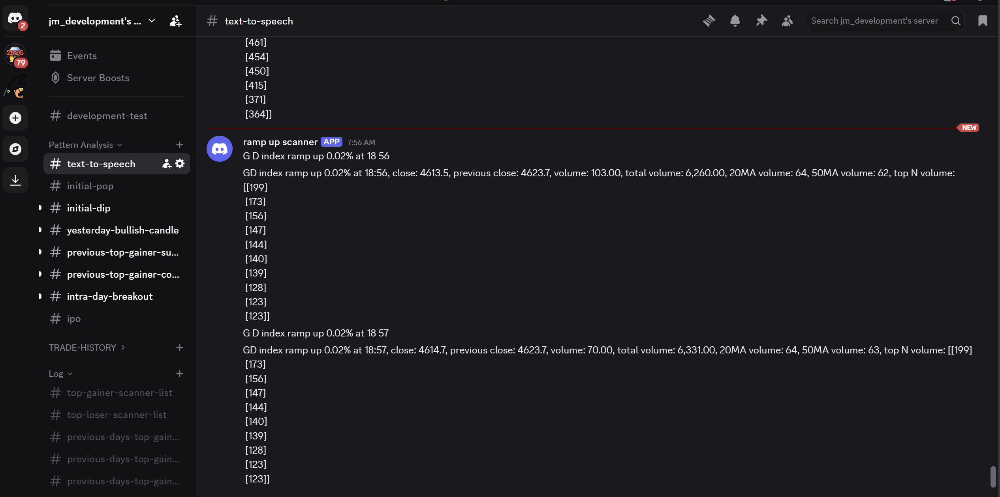
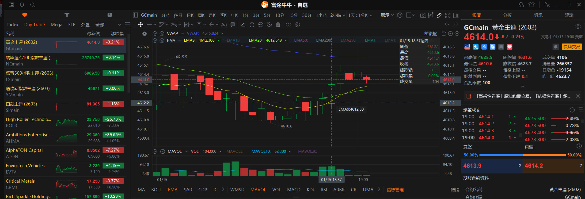
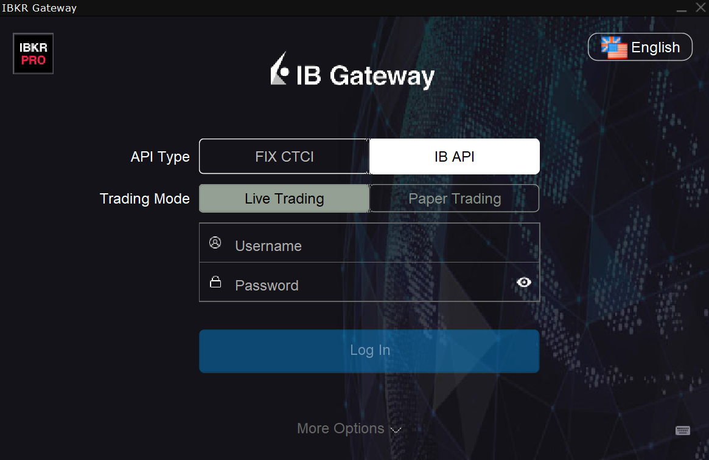
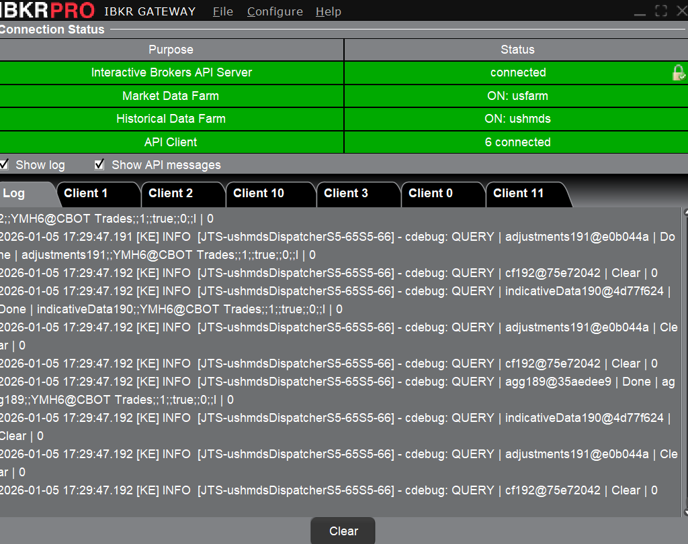
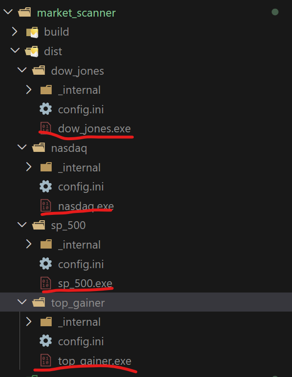

# Market Monitor

### Purposes
- Fetch US major indice futures (WTI Crude Oil, Gold, Nasdaq, S&P500 and Dow Jones) candlestick data and analysis their price actions and send notification to discord server
- Fetch US market top gainer stock candlestick data and analysis their price actions and send notification to discord server

### Demonstration

### Pre-Requisite
1. Download and install IB Gateway
2. Download and install ibapi python package, following the instuction from:
 
https://www.interactivebrokers.com/campus/ibkr-quant-news/interactive-brokers-python-api-native-a-step-by-step-guide/

### Build Executable File
- Run `pip install -r requirements.txt` to install project dependencies
- Run `pip install pyinstaller` to install pyinstaller (if applicable)
- Run `pyinstaller oil.spec -y` to build WTI crude oil index futures scanner
- Run `pyinstaller gold.spec -y` to build gold index futures scanner
- Run `pyinstaller nq.spec -y` to build Nasdaq index futures scanner
- Run `pyinstaller es.spec -y` to build S&P500 index futures scanner
- Run `pyinstaller ym.spec -y` to build Dow Jones index futures scanner
- Run `pyinstaller top_gainer.spec -y` to build top gainer scanner
 
pyinstaller gold.spec -y && pyinstaller nq.spec -y && pyinstaller es.spec -y && pyinstaller ym.spec -y && pyinstaller top_gainer.spec -y
### Core Dependencies
|Dependency|Description|
|:---------|:----------|
| pandas | Dataframe data analysis and manipulation for stock's OHLCV (Open, High, Low, Close, Volume)|
| numpy | Perform comprehensive mathematical and array functions |
| mplfinance | Candlestick chart generation |

### Local Debug Setup

1. Login IB Gateway
2. Run all scanners (`.exe`) files built from pyinstaller

### Export Dependencies list
1. Run `pip3 freeze > requirements.txt`

 

###  
 
